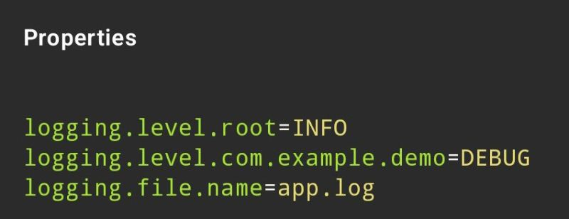

Writing logs is important...

But,

Controlling how much stuff to be logged is even more important❗

Spring Boot makes log configuration simple using:

```
🔹application.properties
```

```
🔹application.yml
```

➡️ Example:

Defining log levels in application.properties (see attached image 👇)

➡️ What Does This Mean?

`🔹logging.level.root=INFO`

Sets the default log level for the whole application.

Only INFO, WARN, and ERROR logs will appear.

`🔹logging.level.com.example.demo=DEBUG`

Overrides logging level for a specific package.

For that package:

- DEBUG logs will also appear
- Useful during development

`🔹logging.file.name=app.log`

Saves logs to a file instead of just printing to console.

Now your logs are persisted 📂

➡️ Production rule:
Dev → DEBUG
Prod → INFO or WARN

Previous post - Spring Boot - Logging: https://lnkd.in/dedhwAP6

