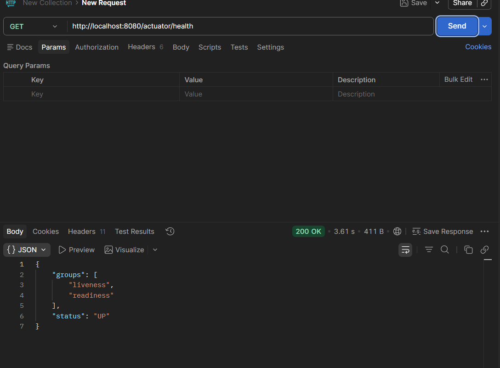

### Building an application is only half the job...

- Monitoring it in production is equally important❗

- This is where Spring Boot Actuator comes in.

- It provides built-in endpoints to monitor and manage your application.

➡️ What is Spring Boot Actuator?

- Spring Boot Actuator exposes useful endpoints that help you inspect your application's:

```
🔹Health
🔹Metrics
🔹Environment properties
🔹Beans
🔹Application info
🔹Thread dumps and more
```

- These endpoints are extremely useful for production monitoring and DevOps integration.

➡️ Add the Dependency

```xml

<dependency>
    <groupId>org.springframework.boot</groupId>
    <artifactId>spring-boot-starter-actuator</artifactId>
</dependency>
```

➡️ Enable Actuator Endpoints

- In application.properties:

- management.endpoints.web.exposure.include=*

- This exposes all actuator endpoints over HTTP.

➡️ Common Actuator Endpoints

Some frequently used endpoints include:

```
🔹/actuator/health → Shows application health status
🔹/actuator/info → Application information
🔹/actuator/metrics → Performance and system metrics
🔹/actuator/env → Environment properties
🔹/actuator/beans → All Spring beans
🔹/actuator/mappings: Shows all request mappings
```

➡️ Sample Endpoint and Response (see attached image 👇)

➡️ Important Note

- By default, only limited endpoints like /health and /info are exposed for security reasons.

- You can explicitly expose others using configuration.

➡️ In Real-Time:

- Actuator is widely used with monitoring tools like Prometheus and Grafana to track application health and performance
  in real time.

Previous post: https://lnkd.in/ddG2F4sd

